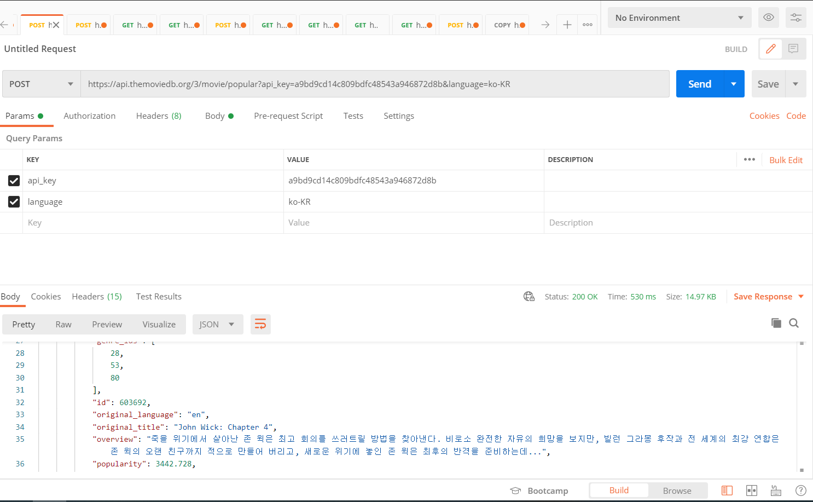

## 구상

### 레이아웃

라우터대신 퍼널 사용해서 간단하게 (토스 slash23 참고)




### API Call 규격

Request

```
{
  "time": {
    "connectionTime": 0,
    "readTime": 0,
    "writeTime": 0
  },
  "count": 0, // 호출 횟수, 기본 1
  "url": "string",
  "httpMethod": "string", // get, post, put, delete, patch 중 하나
  "param": {
    "param1": "string",
    "param2": "string",
    ...
  },
  "header": {
    "header1": "string",
    "header2": "string",
    ...
  },
  "body": {
    ...
  }
}
```

Response

```
[
  {
    "responseTime": 0, //응답 시간
    "body": {}, //응답값 body
    "status": "string" // 200, 500 등의 상태 코드
  },
  ... //Request의 count횟수 만큼 list에 담아서 전달
]
```

### 컴포넌트 기반 개발

- TDD로 진행
  - 스토리북, jest, rtl 활용 테스트
  - emotion, framer, scss로 애니메이션과 스타일링
  - atomic, compound 패턴 활용

### 전역 상태관리

- recoil만 사용?

### 에러처리

- ErrorBoundary, Suspense 활용하기

### 할 일

- API 페이지 prop drilling 해결 
- req url 창에 query params 보여지도록 변경
- Suspense + Error Boundary 넣어서 선언적으로 컴포넌트 만들기
- 스토리북 도입
- 성능 테스트 페이지 들어가기
- Tabs 리렌더링 최적화
- Funnel 리팩토링 (불필요하게 상태로직, children 넣는 것 들어가 있는듯)
